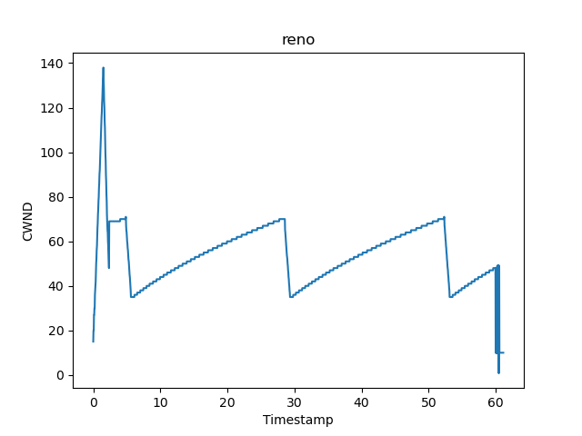
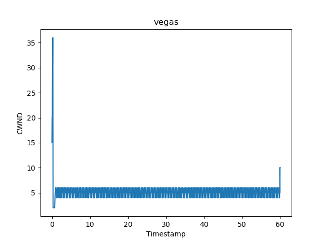
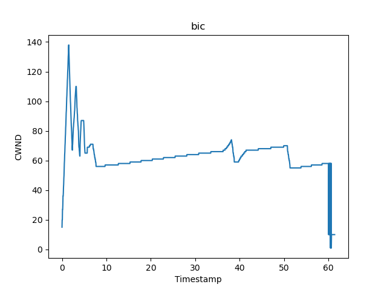
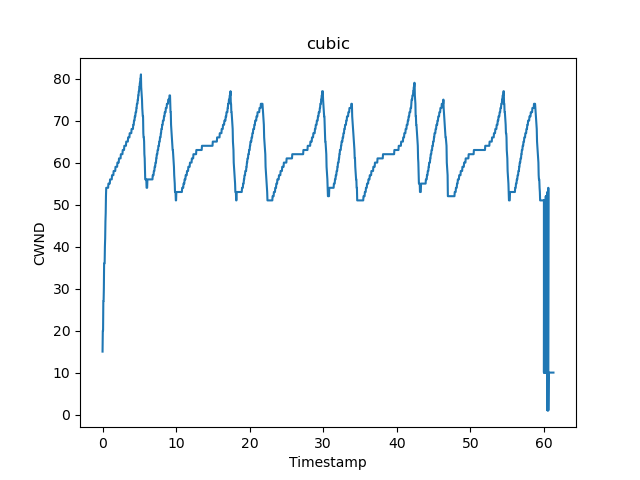
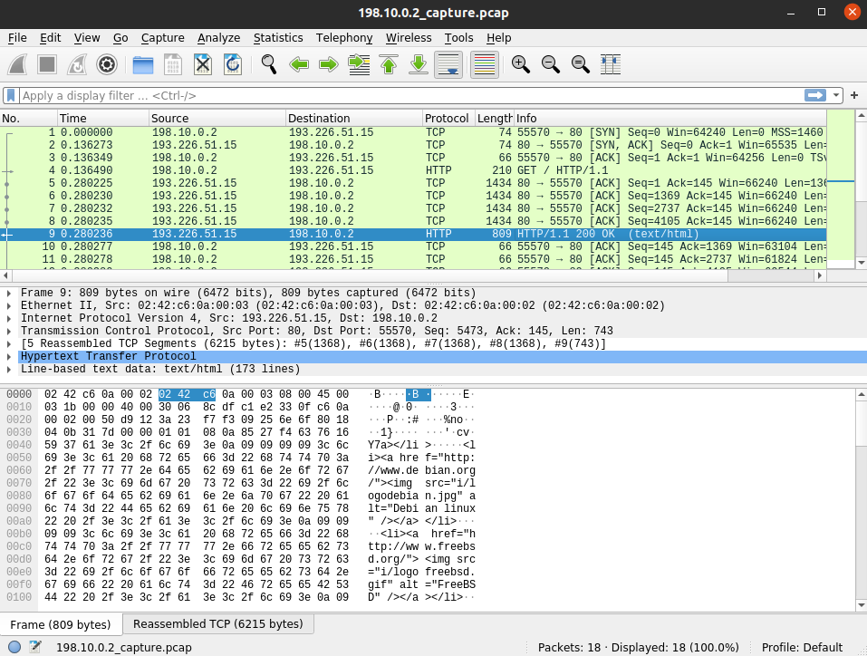

# Tema 2

- [Controlul congestiei (25%)](#congestion)
- Exercițiu la alegere (25%)
  - [Rutare](#rutare)
  - [HTTP API](#http)
- [ARP Spoofing (25%)](#arp_spoof)
- [TCP Hijacking (25%)](#tcp_hij)


<a name="congestion"></a> 
## 1. Controlul congestiei (25%)

### 1.1 Diagrama pentru RENO este:

<!--  -->



TCP este unul dintre cele mai importante protocoale de internet, deoarece acesta transporta cel mai mare volum de trafic pe internet. 

Deoarece TCP transporta atat de mult trafic, este foarte important sa avem metode de a evita incetinirea traficului pe internet din cauza suprautilizarii, acest fenomen se mai numeste 'colaps de congestie'. 

Astfel, pentru a controla congestia, TCP implementeaza urmatoarele metode:

- RWND: pentru a nu trimite mai multe date decat mai poate primi receptorului, header-ul TCP contine o valoare numita window size (RWND). Prin aceasta valoare receptorul ii transmite expeditorului cat de multe date mai poate primi. Astfel, numarul total de pachete neacceptate care sunt in tranzit nu ar trebui sa depaseasca RWND. 
- CWND: pentru fiecare conexiune, ambele parti vor utiliza o fereasta de congestie (CWND), pentru a controla rata de trimitere. Astfel, CWND limiteaza numarul total de pachete neacceptate care pot fi in tranzit. Daca numarul de segmente neacceptate este egal cu CWND, expeditorul inceteaza sa trimita date pana la primirea urmatoarei confirmari. 

Astfel, numarul de pachete trimis de TCP va fi minimul dintre aceste 2 valori (RWND si CWND).

CWND este calculat cu ajutorul unui algoritm de control al congestiei. Acesti algoritmi se bazeaza pe un mecanism principal numit AIMD, iar, peste acesta, se mai folosesc urmatoarele procese (Slow Start, Congestion Avoidance, Fast Retransmit, Fast Recovery):

- AIMD:

  Additive-increase/multiplicative-decrease (AIMD) este un algoritm de control al congestiei care, pe baza evenimentelor de pe retea, creste sau reduce rata de trimitere (CWND). Daca acesta crede ca reteaua este suprautilizata va scadea CWND si daca crede ca reteaua este subutilizata va creste CWND.

  Exista mai multi indicatori de congestie care pot semnala ca reteaua este suprautilizata. Indicatorul pe care i-l vom folosi este pierderea de pachete. Ne putem da seama ca s-au pierdut pachete in 2 moduri:

  - ACK Timeout: se ia timeout la primirea unui pachet, acest indicator este considerat un semnal sever ca reteaua este congestionata si se va reduce CWND drastic. 
  - primirea a unui numar de duplicate pentru un ACK (de exemplu 3): acest indicator nu este considerat asa de sever, iar CWND se va reduce mai putin. 

  Astfel, folosind pierderea de pachete ca indicator de congestie, algoritmul AIMD functioneaza in felul urmator:

  - Additive increase: atunci cand nu exista pierderi de pachete, CWND creste aditiv (de exemplu creste cu 1).
  - Multiplicative decrease: atunci cand exista pierderi de pachete, semn ca reteaua este congestionata, CWND scade drastic cu un factor multiplicativ (de exemplu se imparte la 2).


- Slow Start:

  Cu toate ca AIMD ajuta la evitarea congestiei, poate dura destul de mult timp pana cand fluxul de date atinge capacitatea retelei (optimul), provocand subutilizarea acesteia. Astfel, Slow Start creste CWND de fiecare data cand primeste un ACK, dubland marimea acestuia la fiecare Round-Trip Time (daca fereastra are dimensiunea x, dupa primirea confirmarii pentru toata fereasta, aceasta va deveni 2 * x). Aceasta faza de crestere se opreste cand se pierde un pachet sau se atinge slow start threshold (ssthresh), iar, in acest moment, CWND scade drastic cu un factor multiplicativ si intervine faza AIMD si CWND va creste liniar pana la primul timeout (faza Congestion Avoidance). Slow start threshold este initializat cu o valoarea la inceputul conexiunii, iar la fiecare pierdere de pachete ssthresh devine jumatate din CWND.

  Putem observa pe grafic aceasta faza prin care trece TCP Reno la inceput (timestamp: 0 - 3), unde vedem o crestere foarte rapida a lui CWND si apoi o scadere drastica.

- Congestion Avoidance

  Aceasta faza apare dupa Slow Start, in momentul in care CWND depaseste slow start threshold sau apare o pierdere de pachet. In acest moment intervine AIMD, iar CWND va creste liniar pana la primul timeout. Dupa ce apare primul timeout, CWND va scadea brusc cu un factor multiplicativ (de exemplu se imparte la 2).

  Putem observa pe grafic aceasta faza prin care trece TCP Reno in acele intervale de timp unde CWND creste incet si gradual (timestamp: 8 - 28, 30 - 50, 55 - 59).

- Fast Retransmit 

  Aceasta faza are loc in momentul in care suntem destul de siguri ca ultimul pachet neconfirmat a fost pierdut, de exemplu cand primim ACK duplicate (TCP Reno activeaza aceasta faza la primirea de 3 duplicate). Astfel, se va retransmite pachetul pierdut imediat fara a mai astepta timeout-ul.

  Putem observa pe grafic aceasta faza prin care trece TCP Reno inainte sa se faca scaderea brusca a lui CWND, prin stagnarea valorii CWND pentru foarte putine momente de timp (timestamp: 28 - 29).

- Fast Recovery

  In TCP Reno aceasta faza intervine la primirea a 3 ACK duplicate. Cum acest indicator de congestie nu este atat de sever, TCP Reno va face un Fast Retransmit, va reduce CWND la slow start threshold (ssthresh) si va intra in faza de Congestion Avoidance.

  Putem observa pe grafic aceasta faza prin care trece TCP Reno in momentul in care valoarea CWND scade drastic si se injumatateste.


### 1.2 Diagrame pentru Vegas, Bic si Cubic

- Diagrama pentru Vegas



TCP Vegas este un algoritm de evitare al congestiei TCP care pune accentul mai mult pe intarzierea pachetelor ca indicator de congestie, decat pe pierderea acestora. Acesta poate determina congestia mai rapid (inainte sa se intample de cel mai multe ori) decat alti algoritmi (de exemplu Reno), folosindu-se de cresterea Round-Trip Time-ului (RTT). Daca ar rula pe aceeasi retea cu Reno, performanta lui Vegas se micsoreaza, deoarece acesta reduce rata de trimitere (CWND) mai repede decat Reno, iar, astfel, ofera mai mult spatiu fluxurilor TCP Reno coexsitente.

Pe grafic putem observa, ca si la ceilalti algoritmi, ca are o crestere foarte rapida la inceput (Slow Start) si o coborare la fel de rapida cand isi da seama ca este congestie pe retea. Dar, apoi, putem vedea diferenta majora fata de ceilalti algoritmi; astfel, Vegas creste si scade CWND foarte des pe un interval foarte mic, practic se stabilizeaza foarte repede pe o valoare de CWND mai mica comparativ cu ceilalti. Acest lucru se datoreaza faptului ca Vegas detecteaza o congestie mult mai devreme decat ceilalti algoritmi.

- Diagrama pentru Bic



TCP BIC (Binary Increase Congestion control) este un algoritm de evitare al congestiei TCP care este optimizat pentru retelele de mare viteaza cu o latenta ridicata (long fat networks). Pentru aceste tiputi de retele, BIC are o performanta crescuta fata de algoritmii prezentati anterior, deoarece rezolva problema subutilizarii retelei. Acest algoritm incearca sa gaseasca CWND-ul maxim folosind 3 metode: creste CWND prin cautare binara (binary search increase), creste CWND aditiv (additive increase) si slow start. Cand apare o pierdere de pachet, BIC scade CWND-ul cu un factor multiplicativ.

Pe grafic putem observa, ca si la ceilalti algoritmi, ca are o crestere foarte rapida la inceput (Slow Start) si o injumatatire cand isi da seama ca este congestie pe retea. Apoi, putem vedea, comparativ cu ceilalati algoritmi, ca pana sa intre in faza de Congestion Avoidance, acesta cauta binar CWND-ul optim, facand mai multe cresteri rapide si scaderi bruste. 

- Diagrama pentru Cubic



TCP CUBIC este un algoritm de evitare al congestiei TCP care, ca si BIC, este optimizat pentru retelele de mare viteaza cu o latenta ridicata (long fat networks). Acesta are aceleasi avantaje ca si BIC, doar ca este o varianta mai putin agresiva si mai optimizata a acestuia. Dimensiunea CWND-ului in TCP CUBIC este o functie cubica a timpului de la ultima congestie petrecuta, cu puctul de inflexiune setat la valoarea CWND-ului inainte de congestie. O alta difereanta pe care o are fata de ceilalti algoritmi, este ca nu foloseste valoarea RTT-ului pentru a mari valoarea CWND-ului, astfel, cresterea CWND-ului este independenta de RTT.

Pe grafic putem observa, ca si la ceilalti algoritmi, ca are o crestere foarte rapida la inceput (Slow Start). Apoi, comparativ cu ceilalti algoritmi, continua cu o crestere aditiva, si, apoi, cu o crestere exponentiala din nou. Acesta este un rezultat al faptului ca, cresterea CWND-ului este independenta de RTT. Mai putem observa ca, dupa ce CWND-ul scade rapid, acesta nu incepe imediat o crestere aditiva, ci stagneaza pentru un moement de timp pentru a ii permite retelei sa se stabilizeze.

<a name="rutare"></a> 
## 2. Exercițiu la alegere (25%)

<a name="rutare"></a> 
### Rutare

- Forwarding vs. Routing 
- Link State Routing 
- Distance Vector Routing 
- Open Shortest Path First 
- Border Gateway Protocol Routing 

<a name="http"></a> 
### HTTP API

Aplicația poate fi accesata la adresa:
```
http://ec2-3-86-219-129.compute-1.amazonaws.com/subnet
```

<a name="arp_spoof"></a> 
## 3. ARP Spoofing (25%)

In fisierul arp-spoofing puteti gasi screenshots cu rularile pe containere, si fisierul `.pcap` cu captarea pachetelor.

Scrieție mesajele primite de server, client și printați acțiunile pe care le face middle.
```
root@46a2df61b4a6:/elocal/capitolul3/arp-spoofing# python3 ARP-spoof.py 
[*] Porneste script-ul...
[*] Gateway IP address: 198.10.0.1
[*] Target IP address: 198.10.0.2
Begin emission:
Finished sending 1 packets.
*
Received 1 packets, got 1 answers, remaining 0 packets
[*] Gateway MAC address: 02:42:c6:0a:00:01
Begin emission:
Finished sending 1 packets.
*
Received 1 packets, got 1 answers, remaining 0 packets
[*] Target MAC address: 02:42:c6:0a:00:02
[*] Am pornit atacul de tip ARP poison [CTRL-C pentru a opri]
[*] Pornim captarea pachetelor pe placa de retea. Packet Count: 1000. Filter: ip host 198.10.0.2
.
Sent 1 packets.
.
Sent 1 packets.
.
Sent 1 packets.
.
Sent 1 packets.
.
Sent 1 packets.
.
Sent 1 packets.
^C[*] Oprim captarea pachetelor. Restabilim reteaua...
.....
Sent 5 packets.
.....
Sent 5 packets.
.
Sent 1 packets.
.
Sent 1 packets.
.
Sent 1 packets.
.
Sent 1 packets.
^CException ignored in: <module 'threading' from '/usr/lib/python3.8/threading.py'>
Traceback (most recent call last):
  File "/usr/lib/python3.8/threading.py", line 1388, in _shutdown
    lock.acquire()
KeyboardInterrupt:
```

Rulați pe `middle` comanda `tcpdump -SntvXX -i any` și salvați log-urile aici. Încercați să salvați doar cateva care conțin HTML-ul de la request-ul din server.
```
IP (tos 0x0, ttl 63, id 53958, offset 0, flags [DF], proto TCP (6), length 196)
    198.10.0.3.55570 > 193.226.51.15.80: Flags [P.], cksum 0xbbb5 (incorrect -> 0x7d1f), seq 153447903:153448047, ack 975430291, win 502, options [nop,nop,TS val 1981176119 ecr 2233988045], length 144: HTTP, length: 144
	GET / HTTP/1.1
	User-Agent: Wget/1.20.3 (linux-gnu)
	Accept: */*
	Accept-Encoding: identity
	Host: old.fmi.unibuc.ro
	Connection: Keep-Alive
	
	0x0000:  0004 0001 0006 0242 c60a 0003 0000 0800  .......B........
	0x0010:  4500 00c4 d2c6 4000 3f06 ad6e c60a 0003  E.....@.?..n....
	0x0020:  c1e2 330f d912 0050 0925 6ddf 3a23 e293  ..3....P.%m.:#..
	0x0030:  8018 01f6 bbb5 0000 0101 080a 7616 5937  ............v.Y7
	0x0040:  8527 f3cd 4745 5420 2f20 4854 5450 2f31  .'..GET./.HTTP/1
	0x0050:  2e31 0d0a 5573 6572 2d41 6765 6e74 3a20  .1..User-Agent:.
	0x0060:  5767 6574 2f31 2e32 302e 3320 286c 696e  Wget/1.20.3.(lin
	0x0070:  7578 2d67 6e75 290d 0a41 6363 6570 743a  ux-gnu)..Accept:
	0x0080:  202a 2f2a 0d0a 4163 6365 7074 2d45 6e63  .*/*..Accept-Enc
	0x0090:  6f64 696e 673a 2069 6465 6e74 6974 790d  oding:.identity.
	0x00a0:  0a48 6f73 743a 206f 6c64 2e66 6d69 2e75  .Host:.old.fmi.u
	0x00b0:  6e69 6275 632e 726f 0d0a 436f 6e6e 6563  nibuc.ro..Connec
	0x00c0:  7469 6f6e 3a20 4b65 6570 2d41 6c69 7665  tion:.Keep-Alive
	0x00d0:  0d0a 0d0a                                ....
IP (tos 0x0, ttl 49, id 0, offset 0, flags [DF], proto TCP (6), length 1420)
    193.226.51.15.80 > 198.10.0.3.55570: Flags [.], cksum 0x8f87 (correct), seq 975430291:975431659, ack 153448047, win 1035, options [nop,nop,TS val 2233988195 ecr 1981176119], length 1368: HTTP, length: 1368
	HTTP/1.1 200 OK
	Server: nginx/1.16.1
	Date: Tue, 15 Jun 2021 09:12:59 GMT
	Content-Type: text/html
	Content-Length: 5975
	Last-Modified: Fri, 15 May 2020 14:28:44 GMT
	Connection: keep-alive
	ETag: "5ebea71c-1757"
	Accept-Ranges: bytes
	
	<!DOCTYPE html
	PUBLIC "-//W3C//DTD XHTML 1.0 Transitional//EN"
	"http://www.w3.org/TR/xhtml1/DTD/xhtml1-transitional.dtd">
	<html>
		<head>
			<title>Facultatea de Matematica si Informatica / Faculty of Mathematics and Computer Science</title>
			
			<base href="http://old.fmi.unibuc.ro/" />
			<link rel="icon" href="http://old.fmi.unibuc.ro/favicon.ico" type="image/x-icon" />
			<link rel="shortcut icon" href="http://old.fmi.unibuc.ro/favicon.ico" type="image/x-icon" />
	
			<meta http-equiv="Content-Type" content="text/html; charset=iso-8859-1" />
			<script language="javascript" type="text/javascript">
				function hoverEnter1(obj)
				{obj.src = "i/romaniao.jpg";}
				function hoverEnter2(obj)
				{obj.src = "i/englisho.jpg";}
				function hoverExit1(obj)
				{obj.src = "i/romania.jpg";}
				function hoverExit2(obj)
				{obj.src = "i/english.jpg";}
				function randomImage()
				{	var x = document.getElementById("poza");
					var i = Math.floor(Math.random() * 3);
					var s = "url(i/fotografii"+(i+1)+".jpg) no-repeat top center";
					x.style.background = s;}
			</script>
			
			<style type="text/css">
				body {
					text-align: cent[!http]
	0x0000:  0000 0001 0006 0242 b845 dcd8 0000 0800  .......B.E......
	0x0010:  4500 058c 0000 4000 3106 896d c1e2 330f  E.....@.1..m..3.
	0x0020:  c60a 0003 0050 d912 3a23 e293 0925 6e6f  .....P..:#...%no
	0x0030:  8010 040b 8f87 0000 0101 080a 8527 f463  .............'.c
	0x0040:  7616 5937 4854 5450 2f31 2e31 2032 3030  v.Y7HTTP/1.1.200
	0x0050:  204f 4b0d 0a53 6572 7665 723a 206e 6769  .OK..Server:.ngi
	0x0060:  6e78 2f31 2e31 362e 310d 0a44 6174 653a  nx/1.16.1..Date:
	0x0070:  2054 7565 2c20 3135 204a 756e 2032 3032  .Tue,.15.Jun.202
	0x0080:  3120 3039 3a31 323a 3539 2047 4d54 0d0a  1.09:12:59.GMT..
	0x0090:  436f 6e74 656e 742d 5479 7065 3a20 7465  Content-Type:.te
	0x00a0:  7874 2f68 746d 6c0d 0a43 6f6e 7465 6e74  xt/html..Content
	0x00b0:  2d4c 656e 6774 683a 2035 3937 350d 0a4c  -Length:.5975..L
	0x00c0:  6173 742d 4d6f 6469 6669 6564 3a20 4672  ast-Modified:.Fr
	0x00d0:  692c 2031 3520 4d61 7920 3230 3230 2031  i,.15.May.2020.1
	0x00e0:  343a 3238 3a34 3420 474d 540d 0a43 6f6e  4:28:44.GMT..Con
	0x00f0:  6e65 6374 696f 6e3a 206b 6565 702d 616c  nection:.keep-al
	0x0100:  6976 650d 0a45 5461 673a 2022 3565 6265  ive..ETag:."5ebe
	0x0110:  6137 3163 2d31 3735 3722 0d0a 4163 6365  a71c-1757"..Acce
	0x0120:  7074 2d52 616e 6765 733a 2062 7974 6573  pt-Ranges:.bytes
	0x0130:  0d0a 0d0a 3c21 444f 4354 5950 4520 6874  ....<!DOCTYPE.ht
	0x0140:  6d6c 0a50 5542 4c49 4320 222d 2f2f 5733  ml.PUBLIC."-//W3
	0x0150:  432f 2f44 5444 2058 4854 4d4c 2031 2e30  C//DTD.XHTML.1.0
	0x0160:  2054 7261 6e73 6974 696f 6e61 6c2f 2f45  .Transitional//E
	0x0170:  4e22 0a22 6874 7470 3a2f 2f77 7777 2e77  N"."http://www.w
	0x0180:  332e 6f72 672f 5452 2f78 6874 6d6c 312f  3.org/TR/xhtml1/
	0x0190:  4454 442f 7868 746d 6c31 2d74 7261 6e73  DTD/xhtml1-trans
	0x01a0:  6974 696f 6e61 6c2e 6474 6422 3e0a 3c68  itional.dtd">.<h
	0x01b0:  746d 6c3e 0a09 3c68 6561 643e 0a09 093c  tml>..<head>...<
	0x01c0:  7469 746c 653e 4661 6375 6c74 6174 6561  title>Facultatea
	0x01d0:  2064 6520 4d61 7465 6d61 7469 6361 2073  .de.Matematica.s
	0x01e0:  6920 496e 666f 726d 6174 6963 6120 2f20  i.Informatica./.
	0x01f0:  4661 6375 6c74 7920 6f66 204d 6174 6865  Faculty.of.Mathe
	0x0200:  6d61 7469 6373 2061 6e64 2043 6f6d 7075  matics.and.Compu
	0x0210:  7465 7220 5363 6965 6e63 653c 2f74 6974  ter.Science</tit
	0x0220:  6c65 3e0a 0909 0a09 093c 6261 7365 2068  le>......<base.h
	0x0230:  7265 663d 2268 7474 703a 2f2f 6f6c 642e  ref="http://old.
	0x0240:  666d 692e 756e 6962 7563 2e72 6f2f 2220  fmi.unibuc.ro/".
	0x0250:  2f3e 0a09 093c 6c69 6e6b 2072 656c 3d22  />...<link.rel="
	0x0260:  6963 6f6e 2220 6872 6566 3d22 6874 7470  icon".href="http
	0x0270:  3a2f 2f6f 6c64 2e66 6d69 2e75 6e69 6275  ://old.fmi.unibu
	0x0280:  632e 726f 2f66 6176 6963 6f6e 2e69 636f  c.ro/favicon.ico
	0x0290:  2220 7479 7065 3d22 696d 6167 652f 782d  ".type="image/x-
	0x02a0:  6963 6f6e 2220 2f3e 0a09 093c 6c69 6e6b  icon"./>...<link
	0x02b0:  2072 656c 3d22 7368 6f72 7463 7574 2069  .rel="shortcut.i
	0x02c0:  636f 6e22 2068 7265 663d 2268 7474 703a  con".href="http:
	0x02d0:  2f2f 6f6c 642e 666d 692e 756e 6962 7563  //old.fmi.unibuc
	0x02e0:  2e72 6f2f 6661 7669 636f 6e2e 6963 6f22  .ro/favicon.ico"
	0x02f0:  2074 7970 653d 2269 6d61 6765 2f78 2d69  .type="image/x-i
	0x0300:  636f 6e22 202f 3e0a 0a09 093c 6d65 7461  con"./>....<meta
	0x0310:  2068 7474 702d 6571 7569 763d 2243 6f6e  .http-equiv="Con
	0x0320:  7465 6e74 2d54 7970 6522 2063 6f6e 7465  tent-Type".conte
	0x0330:  6e74 3d22 7465 7874 2f68 746d 6c3b 2063  nt="text/html;.c
	0x0340:  6861 7273 6574 3d69 736f 2d38 3835 392d  harset=iso-8859-
	0x0350:  3122 202f 3e0a 0909 3c73 6372 6970 7420  1"./>...<script.
	0x0360:  6c61 6e67 7561 6765 3d22 6a61 7661 7363  language="javasc
	0x0370:  7269 7074 2220 7479 7065 3d22 7465 7874  ript".type="text
	0x0380:  2f6a 6176 6173 6372 6970 7422 3e0a 0909  /javascript">...
	0x0390:  0966 756e 6374 696f 6e20 686f 7665 7245  .function.hoverE
	0x03a0:  6e74 6572 3128 6f62 6a29 0a09 0909 7b6f  nter1(obj)....{o
	0x03b0:  626a 2e73 7263 203d 2022 692f 726f 6d61  bj.src.=."i/roma
	0x03c0:  6e69 616f 2e6a 7067 223b 7d0a 0909 0966  niao.jpg";}....f
	0x03d0:  756e 6374 696f 6e20 686f 7665 7245 6e74  unction.hoverEnt
	0x03e0:  6572 3228 6f62 6a29 0a09 0909 7b6f 626a  er2(obj)....{obj
	0x03f0:  2e73 7263 203d 2022 692f 656e 676c 6973  .src.=."i/englis
	0x0400:  686f 2e6a 7067 223b 7d0a 0909 0966 756e  ho.jpg";}....fun
	0x0410:  6374 696f 6e20 686f 7665 7245 7869 7431  ction.hoverExit1
	0x0420:  286f 626a 290a 0909 097b 6f62 6a2e 7372  (obj)....{obj.sr
	0x0430:  6320 3d20 2269 2f72 6f6d 616e 6961 2e6a  c.=."i/romania.j
	0x0440:  7067 223b 7d0a 0909 0966 756e 6374 696f  pg";}....functio
	0x0450:  6e20 686f 7665 7245 7869 7432 286f 626a  n.hoverExit2(obj
	0x0460:  290a 0909 097b 6f62 6a2e 7372 6320 3d20  )....{obj.src.=.
	0x0470:  2269 2f65 6e67 6c69 7368 2e6a 7067 223b  "i/english.jpg";
	0x0480:  7d0a 0909 0966 756e 6374 696f 6e20 7261  }....function.ra
	0x0490:  6e64 6f6d 496d 6167 6528 290a 0909 097b  ndomImage()....{
	0x04a0:  0976 6172 2078 203d 2064 6f63 756d 656e  .var.x.=.documen
	0x04b0:  742e 6765 7445 6c65 6d65 6e74 4279 4964  t.getElementById
	0x04c0:  2822 706f 7a61 2229 3b0a 0909 0909 7661  ("poza");.....va
	0x04d0:  7220 6920 3d20 4d61 7468 2e66 6c6f 6f72  r.i.=.Math.floor
	0x04e0:  284d 6174 682e 7261 6e64 6f6d 2829 202a  (Math.random().*
	0x04f0:  2033 293b 0a09 0909 0976 6172 2073 203d  .3);.....var.s.=
	0x0500:  2022 7572 6c28 692f 666f 746f 6772 6166  ."url(i/fotograf
	0x0510:  6969 222b 2869 2b31 292b 222e 6a70 6729  ii"+(i+1)+".jpg)
	0x0520:  206e 6f2d 7265 7065 6174 2074 6f70 2063  .no-repeat.top.c
	0x0530:  656e 7465 7222 3b0a 0909 0909 782e 7374  enter";.....x.st
	0x0540:  796c 652e 6261 636b 6772 6f75 6e64 203d  yle.background.=
	0x0550:  2073 3b7d 0a09 093c 2f73 6372 6970 743e  .s;}...</script>
	0x0560:  0a09 090a 0909 3c73 7479 6c65 2074 7970  ......<style.typ
	0x0570:  653d 2274 6578 742f 6373 7322 3e0a 0909  e="text/css">...
	0x0580:  0962 6f64 7920 7b0a 0909 0909 7465 7874  .body.{.....text
	0x0590:  2d61 6c69 676e 3a20 6365 6e74            -align:.cent
```
Captura din wireshark, care e mai verbose:


<a name="tcp_hij"></a> 
## 4. TCP Hijacking (25%)
Scrieție mesajele primite de server, client și printați acțiunile pe care le face middle.


Logs de pe container-ul server:
```
root@7279f4891375:/elocal/capitolul3/tcp-hijacking# python3 tcp_server.py 
[LINE:14]# INFO     [2021-06-15 11:17:34,618]  Serverul a pornit pe 0.0.0.0 si portul 10001
[LINE:18]# INFO     [2021-06-15 11:17:34,618]  Asteptam conexiuni...
[LINE:20]# INFO     [2021-06-15 11:17:36,611]  Handshake successful cu ('198.10.0.1', 44816)
[LINE:25]# INFO     [2021-06-15 11:17:39,615]  Content primit: "b'You just got haxxed -> MesajOriginal'"
Incercam sa trimitem raspuns...
[LINE:25]# INFO     [2021-06-15 11:17:41,617]  Content primit: "b'You just got haxxed -> MesajOriginal'"
Incercam sa trimitem raspuns...
[LINE:25]# INFO     [2021-06-15 11:17:43,619]  Content primit: "b'You just got haxxed -> MesajOriginal'"
Incercam sa trimitem raspuns...
[LINE:25]# INFO     [2021-06-15 11:17:45,621]  Content primit: "b'You just got haxxed -> MesajOriginal'"
Incercam sa trimitem raspuns...
[LINE:25]# INFO     [2021-06-15 11:17:47,623]  Content primit: "b'You just got haxxed -> MesajOriginal'"
Incercam sa trimitem raspuns...
^CTraceback (most recent call last):
  File "tcp_server.py", line 28, in <module>
    time.sleep(2)
KeyboardInterrupt
```

Logs de pe container-ul client:
```
root@d97f1608d5a2:/elocal/capitolul3/tcp-hijacking# python3 tcp_client.py 
[LINE:23]# INFO     [2021-06-15 11:17:36,436]  Handshake cu ('198.10.0.2', 10001)
[LINE:25]# INFO     [2021-06-15 11:17:36,539]  Handshake sucessful!
[LINE:26]# INFO     [2021-06-15 11:17:36,539]  Beginning data transmission
[LINE:20]# INFO     [2021-06-15 11:17:40,543]  Content primit: "b'You just got haxxed -> Server a primit mesajul: You just got haxxed -> MesajOriginal'"
[LINE:20]# INFO     [2021-06-15 11:17:42,546]  Content primit: "b'You just got haxxed -> Server a primit mesajul: You just got haxxed -> MesajOriginal'"
[LINE:20]# INFO     [2021-06-15 11:17:44,547]  Content primit: "b'You just got haxxed -> Server a primit mesajul: You just got haxxed -> MesajOriginal'"
[LINE:20]# INFO     [2021-06-15 11:17:46,550]  Content primit: "b'You just got haxxed -> Server a primit mesajul: You just got haxxed -> MesajOriginal'"
^C[LINE:32]# INFO     [2021-06-15 11:17:47,395]  Closing socket...
Traceback (most recent call last):
  File "tcp_client.py", line 29, in <module>
    send_once()
  File "tcp_client.py", line 18, in send_once
    time.sleep(2)
KeyboardInterrupt
```

Logs de pe container-ul middle, fragmente. Varianta full se poate gasi [aici](./tcp-hijacking/middle_logs.txt)
```
Pachet initial:
###[ IP ]### 
  version   = 4
  ihl       = 5
  tos       = 0x0
  len       = 53
  id        = 37000
  flags     = DF
  frag      = 0
  ttl       = 62
  proto     = tcp
  chksum    = 0x2023
  src       = 198.10.0.1
  dst       = 198.10.0.2
  \options   \
###[ TCP ]### 
     sport     = 44816
     dport     = 10001
     seq       = 1571588346
     ack       = 1709498730
     dataofs   = 5
     reserved  = 0
     flags     = PA
     window    = 64240
     chksum    = 0x4554
     urgptr    = 0
     options   = []
###[ Raw ]### 
        load      = 'MesajOriginal'

Pachet dupa:
###[ IP ]### 
  version   = 4
  ihl       = 5
  tos       = 0x0
  len       = 76
  id        = 1
  flags     = 
  frag      = 0
  ttl       = 64
  proto     = tcp
  chksum    = 0xee93
  src       = 198.10.0.1
  dst       = 198.10.0.2
  \options   \
###[ TCP ]### 
     sport     = 44816
     dport     = 10001
     seq       = 1571588346
     ack       = 1709498730
     dataofs   = 5
     reserved  = 0
     flags     = PA
     window    = 8192
     chksum    = 0xcc9f
     urgptr    = 0
     options   = []
###[ Raw ]### 
        load      = 'You just got haxxed -> MesajOriginal'

Pachet initial:
###[ IP ]### 
  version   = 4
  ihl       = 5
  tos       = 0x0
  len       = 101
  id        = 15469
  flags     = DF
  frag      = 0
  ttl       = 63
  proto     = tcp
  chksum    = 0x730e
  src       = 198.10.0.2
  dst       = 198.10.0.1
  \options   \
###[ TCP ]### 
     sport     = 10001
     dport     = 44816
     seq       = 1709498730
     ack       = 1571588382
     dataofs   = 5
     reserved  = 0
     flags     = PA
     window    = 64204
     chksum    = 0xb3b2
     urgptr    = 0
     options   = []
###[ Raw ]### 
        load      = 'Server a primit mesajul: You just got haxxed -> MesajOriginal'

Pachet dupa:
###[ IP ]### 
  version   = 4
  ihl       = 5
  tos       = 0x0
  len       = 124
  id        = 1
  flags     = 
  frag      = 0
  ttl       = 64
  proto     = tcp
  chksum    = 0xee63
  src       = 198.10.0.2
  dst       = 198.10.0.1
  \options   \
###[ TCP ]### 
     sport     = 10001
     dport     = 44816
     seq       = 1709498730
     ack       = 1571588359
     dataofs   = 5
     reserved  = 0
     flags     = PA
     window    = 8192
     chksum    = 0x5ad1
     urgptr    = 0
     options   = []
###[ Raw ]### 
        load      = 'You just got haxxed -> Server a primit mesajul: You just got haxxed -> MesajOriginal'

```

Rulați pe `middle` comanda `tcpdump -SntvXX -i any` și salvați log-urile aici. Încercați să salvați doar cateva care conțin HTML-ul de la request-ul din server.
```
ARP, Ethernet (len 6), IPv4 (len 4), Reply 198.10.0.2 is-at 02:42:c6:0a:00:03, length 28
	0x0000:  0004 0001 0006 0242 c60a 0003 0000 0806  .......B........
	0x0010:  0001 0800 0604 0002 0242 c60a 0003 c60a  .........B......
	0x0020:  0002 0242 c60a 0001 c60a 0001            ...B........
ARP, Ethernet (len 6), IPv4 (len 4), Reply 198.10.0.1 is-at 02:42:c6:0a:00:03, length 28
	0x0000:  0004 0001 0006 0242 c60a 0003 0000 0806  .......B........
	0x0010:  0001 0800 0604 0002 0242 c60a 0003 c60a  .........B......
	0x0020:  0001 0242 c60a 0002 c60a 0002            ...B........
IP (tos 0x0, ttl 63, id 26828, offset 0, flags [DF], proto TCP (6), length 53)
    198.10.0.1.45042 > 198.10.0.2.10001: Flags [P.], cksum 0x8c3f (incorrect -> 0x1ea6), seq 225625649:225625662, ack 1709644343, win 64240, length 13
	0x0000:  0000 0001 0006 0242 c60a 0001 0000 0800  .......B........
	0x0010:  4500 0035 68cc 4000 3f06 46df c60a 0001  E..5h.@.?.F.....
	0x0020:  c60a 0002 aff2 2711 0d72 c631 65e7 1a37  ......'..r.1e..7
	0x0030:  5018 faf0 8c3f 0000 4d65 7361 6a4f 7269  P....?..MesajOri
	0x0040:  6769 6e61 6c                             ginal
IP (tos 0x0, ttl 64, id 1, offset 0, flags [none], proto TCP (6), length 76)
    198.10.0.1.45042 > 198.10.0.2.10001: Flags [P.], cksum 0xa5f1 (correct), seq 225625649:225625685, ack 1709644343, win 8192, length 36
	0x0000:  0004 0001 0006 0242 c60a 0003 0000 0800  .......B........
	0x0010:  4500 004c 0001 0000 4006 ee93 c60a 0001  E..L....@.......
	0x0020:  c60a 0002 aff2 2711 0d72 c631 65e7 1a37  ......'..r.1e..7
	0x0030:  5018 2000 a5f1 0000 596f 7520 6a75 7374  P.......You.just
	0x0040:  2067 6f74 2068 6178 7865 6420 2d3e 204d  .got.haxxed.->.M
	0x0050:  6573 616a 4f72 6967 696e 616c            esajOriginal
```